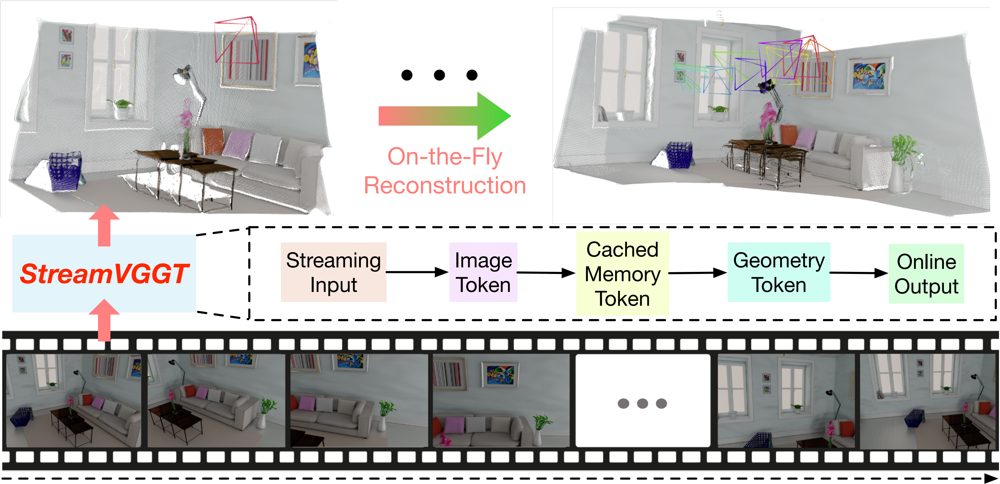
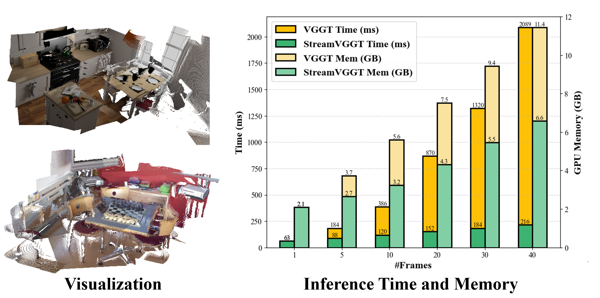

<div align="center">
<h1>Streaming 4D Visual Geometry Transformer</h1>
</div>

### [Paper](https://arxiv.org/abs/2507.11539)  | [Project Page](https://wzzheng.net/StreamVGGT)  | [Online Demo](https://huggingface.co/spaces/lch01/StreamVGGT)

>Streaming 4D Visual Geometry Transformer

>Dong Zhuo<sup>\*</sup>, [Wenzhao Zheng](https://wzzheng.net/)<sup>*</sup>$\dagger$,  Jiahe Guo, Yuqi Wu, [Jie Zhou](https://scholar.google.com/citations?user=6a79aPwAAAAJ&hl=en&authuser=1), [Jiwen Lu](http://ivg.au.tsinghua.edu.cn/Jiwen_Lu/)

<sup>*</sup> Equal contribution. $\dagger$ Project leader.


**StreamVGGT**, a causal transformer architecture for **real-time streaming 4D visual geometry perception** compatiable with LLM-targeted attention mechanism (e.g., [FlashAttention](https://github.com/Dao-AILab/flash-attention)), delivers both fast inference and high-quality 4D reconstruction.

## News

- **[2025/7/18]** [Demo](https://huggingface.co/spaces/lch01/StreamVGGT) and [checkpoints](https://huggingface.co/lch01/StreamVGGT/) released on Hugging Face; demo code is available for local launch.
- **[2025/7/15]** Paper released on [arXiv](https://arxiv.org/abs/2507.11539).
- **[2025/7/14]** Release the code for **fine-tuning VGGT**.
- **[2025/7/13]** Check out [Point3R](https://github.com/YkiWu/Point3R) for another streaming 3D reconstruction work of ours!
- **[2025/7/13]** Distillation code for VGGT is released.
- **[2025/7/13]** Inference code with [FlashAttention-2](https://github.com/Dao-AILab/flash-attention) is released.
- **[2025/7/13]** Training/evaluation code release.

## Overview

Given a sequence of images, unlike offline models that require reprocessing the entire sequence and reconstructing the entire scene upon receiving each new image, our StreamVGGT employs temporal
causal attention and leverages cached memory token to support efficient incremental on-the-fly reconstruction, enabling interative and real-time online applitions.



### On-the-Fly Online Reconstruction from Streaming Inputs



### Installation

1. Clone StreamVGGT
```bash
git clone https://github.com/wzzheng/StreamVGGT.git
cd StreamVGGT
```
2. Create conda environment
```bash
conda create -n StreamVGGT python=3.11 cmake=3.14.0
conda activate StreamVGGT 
```

3. Install requirements
```bash
pip install -r requirements.txt
conda install 'llvm-openmp<16'
```

### Download Checkpoints
Please download pretrained teacher model from [here](https://huggingface.co/facebook/VGGT-1B/blob/main/model.pt).

The checkpoint of StreamVGGT is also available at both [Hugging Face](https://huggingface.co/lch01/StreamVGGT/) and [Tsinghua cloud](https://cloud.tsinghua.edu.cn/d/d6ad8f36fcd541bcb246/).


## Data Preparation
### Training Datasets
Our training data includes 14 datasets. Please download the datasets from their official sources and refer to [CUT3R](https://github.com/CUT3R/CUT3R/blob/main/docs/preprocess.md) for processing these datasets.

  - [ARKitScenes](https://github.com/apple/ARKitScenes) 
  - [BlendedMVS](https://github.com/YoYo000/BlendedMVS)
  - [CO3Dv2](https://github.com/facebookresearch/co3d)
  - [MegaDepth](https://www.cs.cornell.edu/projects/megadepth/)
  - [MVS-Synth](https://phuang17.github.io/DeepMVS/mvs-synth.html)
  - [ScanNet++](https://kaldir.vc.in.tum.de/scannetpp/) 
  - [ScanNet](http://www.scan-net.org/ScanNet/)
  - [Spring](https://spring-benchmark.org/)
  - [Hypersim](https://github.com/apple/ml-hypersim)
  - [WildRGB-D](https://github.com/wildrgbd/wildrgbd/)
  - [WayMo Open dataset](https://github.com/waymo-research/waymo-open-dataset)
  - [Virtual KITTI 2](https://europe.naverlabs.com/research/computer-vision/proxy-virtual-worlds-vkitti-2/)
  - [OmniObject3D](https://omniobject3d.github.io/)
  - [PointOdyssey](https://pointodyssey.com/)

### Evaluation Datasets
Please refer to [MonST3R](https://github.com/Junyi42/monst3r/blob/main/data/evaluation_script.md) and [Spann3R](https://github.com/HengyiWang/spann3r/blob/main/docs/data_preprocess.md) to prepare Sintel, Bonn, KITTI, NYU-v2, ScanNet, 7scenes and Neural-RGBD datasets.

## Folder Structure
The overall folder structure should be organized as follows：
```
StreamVGGT
├── ckpt/
|   ├── model.pt
|   └── checkpoints.pth
├── config/
|   ├── ...
├── data/
│   ├── eval/
|   |   ├── 7scenes
|   |   ├── bonn
|   |   ├── kitti
|   |   ├── neural_rgbd
|   |   ├── nyu-v2
|   |   ├── scannetv2
|   |   └── sintel
│   ├── train/
│   │   ├── processed_arkitscenes
|   |   ├── ...
└── src/
    ├── ...
```

## Finetuning VGGT
We also provide the following commands to fine-tune VGGT (excluding the track head) if you like. 
```bash
cd src/
NCCL_DEBUG=TRACE TORCH_DISTRIBUTED_DEBUG=DETAIL HYDRA_FULL_ERROR=1 accelerate launch --multi_gpu --main_process_port 26902 ./finetune.py --config-name finetune
```

## Training StreamVGGT
We provide the following commands for training.

```bash
cd src/
NCCL_DEBUG=TRACE TORCH_DISTRIBUTED_DEBUG=DETAIL HYDRA_FULL_ERROR=1 accelerate launch --multi_gpu --main_process_port 26902 ./train.py --config-name train
```

## Evaluation
The evaluation code follows [MonST3R](https://github.com/Junyi42/monst3r/blob/main/data/evaluation_script.md), [CUT3R](https://github.com/CUT3R/CUT3R/blob/main/docs/eval.md) and [VGGT](https://github.com/facebookresearch/vggt).

```bash
cd src/
```
### Monodepth
```bash
bash eval/monodepth/run.sh 
```

Results will be saved in `eval_results/monodepth/${data}_${model_name}/metric.json`.

### VideoDepth
```bash
bash eval/video_depth/run.sh 
```

Results will be saved in `eval_results/video_depth/${data}_${model_name}/result_scale.json`.

### Multi-view Reconstruction
```bash
bash eval/mv_recon/run.sh 
```

Results will be saved in `eval_results/mv_recon/${model_name}_${ckpt_name}/logs_all.txt`.

### Camera Pose Estimation
1. Install the required dependencies:
```bash
pip install pycolmap==3.10.0 pyceres==2.3
git clone https://github.com/cvg/LightGlue.git
cd LightGlue
python -m pip install -e .
cd ..
```
2. Please refer to [VGGT](https://github.com/facebookresearch/vggt) to prepare the co3d dataset.

3. Run the evaluation code:
```bash
python eval/pose_evaluation/test_co3d.py --co3d_dir /YOUR/CO3D/PATH --co3d_anno_dir /YOUR/CO3D/ANNO/PATH --seed 0
```

## Demo
We provide a demo for StreamVGGT, based on the demo code from [VGGT](https://github.com/facebookresearch/vggt). You can follow the instructions below to launch it locally or try it out directly on [Hugging Face](https://huggingface.co/spaces/lch01/StreamVGGT).
```bash
pip install -r requirements_demo.txt
python demo_gradio.py
```

**Note**: While StreamVGGT typically reconstructs a scene in under one second, 3D point visualization may take much longer due to slower third-party rendering.

## Acknowledgements
Our code is based on the following brilliant repositories:

[DUSt3R](https://github.com/naver/dust3r)
[MonST3R](https://github.com/Junyi42/monst3r.git)
[Spann3R](https://github.com/HengyiWang/spann3r.git)
[CUT3R](https://github.com/CUT3R/CUT3R)
[VGGT](https://github.com/facebookresearch/vggt)
[Point3R](https://github.com/YkiWu/Point3R)

Many thanks to these authors!

## Citation

If you find this project helpful, please consider citing the following paper:
```
@article{streamVGGT,
      title={Streaming 4D Visual Geometry Transformer}, 
      author={Dong Zhuo and Wenzhao Zheng and Jiahe Guo and Yuqi Wu and Jie Zhou and Jiwen Lu},
      journal={arXiv preprint arXiv:2507.11539},
      year={2025}
}
```
